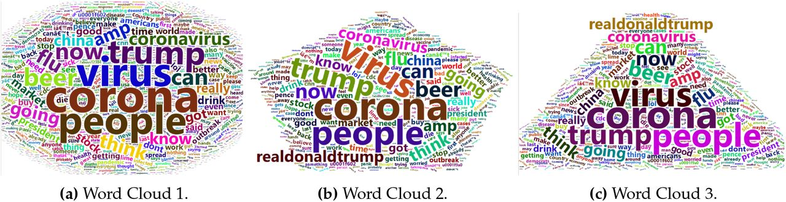

# Coronavirus-tweets-NLP---Multi-Text-Classification
The project is about multi classification problem, the data set contained the raw tweets provide by different age group of people. This repository contains the code for pre-processing and applying machine learning techniques to predict sentiments of the user.

## Dataset
(https://www.kaggle.com/datatattle/covid-19-nlp-text-classification)

## Libraries Needed
- sklearn
- numpy
- pandas
- matplotlib
- seaborn
- nltk
- keras
- gensim
- glob
- re

## Description 
In this work, the project consists of three variants. After downloading the data from Kaggle, I performed the data analysis and data pre-processing. The data pre-processing module includes: Lemmatization, stop words and punctuation removal.

## version 1
The performance of several ML Classifiers is tested:
- **Naive Bayes** 
- **Ada boost (AB)**
- **Gradient Boosting Classifier (GBC)**
- **Random Forest (RF)**

Among these, RF and GBC perfom well on this data set. After that, I optimized the **hyper-parameters** of RF by using **Randomized Search CV**.

## version 2
In this module, the given below model and techniques have been implemented 
- **Feed Forward Neural Network** 
- **Data imbalance techniques** 

From the graphical illustration of data analysis techniques, we can see that data set falls in data imbalance category. In order to overcome this issue, I used the class weights technique. At the end, I designed the neural network architecture and trained the model and listed the classification report to see the performance of the model.

## version 3
In the 3rd variant, instead of combining the similar classes into single class, that was done in earlier variants, I used them as separate classes and trained the deep learning model.

## How to Run The Code
All the code and comments are listed in the jupyter notbook (NLP-covid-19 -Text Classification.ipynb)

